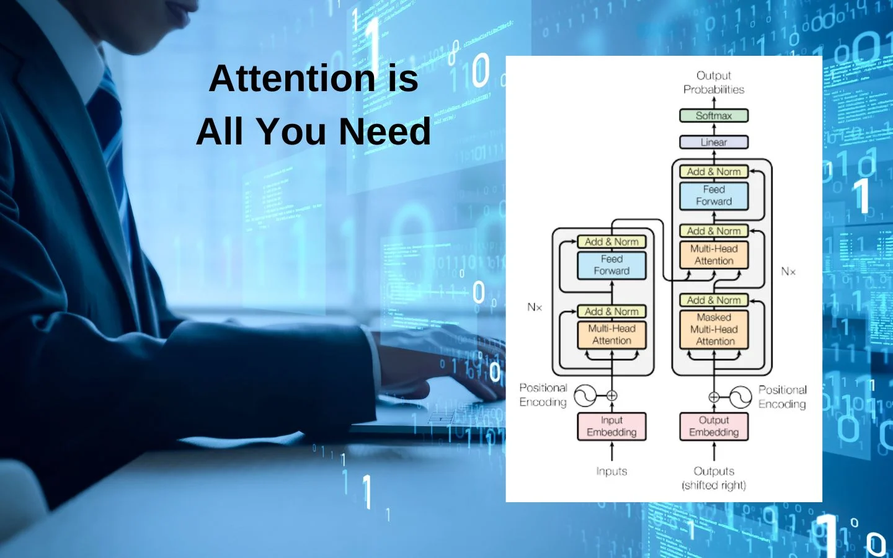

# 🧠⚙️ Implementing the Transformer Architecture from Scratch

> A step-by-step implementation and learning journey into one of the most revolutionary architectures in deep learning — the **Transformer**.

---

  

## 📘 Overview

This repository is dedicated to **building the Transformer architecture from scratch** — the same model introduced in the groundbreaking paper [*Attention Is All You Need (Vaswani et al., 2017)*](https://proceedings.neurips.cc/paper_files/paper/2017/file/3f5ee243547dee91fbd053c1c4a845aa-Paper.pdf).

Through this project, I aim to **understand every component, math concept, and design decision** that made Transformers the backbone of modern NLP systems like **BERT, GPT, and T5**.

Each commit and notebook in this repository represents a step in the journey — from theory to clean, functional code.

---

## 🎯 Project Goals

- Understand the internal mechanics of **self-attention** and **multi-head attention**
- Recreate the **encoder–decoder architecture** from scratch using PyTorch
- Learn and share insights into how Transformers revolutionized **sequence modeling**
- Build a **reference implementation** for others learning deep learning fundamentals
- Post **bi-weekly progress updates** on [LinkedIn](www.linkedin.com/in/ehtisham-afzal-22553a373) (twice a week)

---

## 🧩 Key Components and Implementation Steps

### 1️⃣ Input Embeddings and Positional Encoding
- **Token Embeddings:** Convert input tokens (e.g., words) into dense numerical vectors.
- **Positional Encoding:** Since Transformers process sequences in parallel (without order), positional encodings add order information.  
  Implemented using sine and cosine functions of varying frequencies.

### 2️⃣ Encoder Block
- **Multi-Head Self-Attention:**  
  Enables the model to learn relationships between different positions in a sequence.  
  Multiple attention heads capture various contextual aspects simultaneously.
- **Add & Normalize:**  
  Residual connections followed by layer normalization stabilize and accelerate training.
- **Feed-Forward Network:**  
  A position-wise fully connected network with ReLU activation.
- **Stacked Encoder Layers:**  
  Multiple encoder blocks build the complete encoder representation.

### 3️⃣ Decoder Block
- **Masked Multi-Head Self-Attention:**  
  Prevents attending to future tokens during training (ensuring autoregressive prediction).
- **Encoder–Decoder Attention:**  
  Allows the decoder to attend to the encoder output, linking source and target sequences.
- **Feed-Forward Network + Add & Normalize:**  
  Similar to the encoder block structure.
- **Stacked Decoder Layers:**  
  Multiple layers form the complete decoder.

### 4️⃣ Output Layer
- A final **linear layer + softmax** converts the decoder outputs into vocabulary probabilities, enabling next-token prediction.

---

## ⚙️ Implementation Details

- **Framework:** [PyTorch](https://pytorch.org/)  
- **Loss Function:** Cross-entropy loss for sequence-to-sequence learning  
- **Optimizer:** Adam optimizer with learning rate scheduling  
- **Masking:**  
  - Padding mask for encoder/decoder inputs  
  - Look-ahead mask for decoder self-attention  
- **Hyperparameters:**  
  - Embedding dimension  
  - Number of attention heads  
  - Encoder/decoder layers  
  - Dropout rates and learning rate  

---

## 🧠 Why This Project Matters

Before the Transformer, models like RNNs and LSTMs struggled with:
- Sequential processing (no parallelism)
- Limited long-term context understanding
- Slow training and scaling issues  

The Transformer introduced:
- **Parallelism** in training
- **Global context awareness** via self-attention
- **Scalability** across massive datasets  

This architectural leap is what powered the modern **NLP revolution** — enabling models like ChatGPT, Gemini, Claude, and more.

---

---

## 🚀 Learning Roadmap

| Week | Focus Area | Description |
|------|-------------|-------------|
| 1 | Embeddings & Positional Encoding | Understanding tokenization and sequence representation |
| 2 | Scaled Dot-Product Attention | Building self-attention from scratch |
| 3 | Multi-Head Attention & Normalization | Combining multiple heads + stable training |
| 4 | Encoder–Decoder Integration | Building the full transformer block |
| 5 | Training Pipeline | Data loading, masking, and training loop setup |
| 6 | Testing & Visualization | Evaluating and visualizing attention maps |

---

## 🌱 Progress Updates

I’ll be sharing my journey, learnings, and progress updates **twice a week** on [LinkedIn](https://www.linkedin.com/in/)  
Follow along, learn, and contribute!  
If you’d like to collaborate or suggest improvements — PRs and discussions are welcome.

---

## 🧠 References
- Vaswani et al., *Attention Is All You Need*, 2017 — [arXiv Paper](https://proceedings.neurips.cc/paper_files/paper/2017/file/3f5ee243547dee91fbd053c1c4a845aa-Paper.pdf)
- [The Illustrated Transformer – Jay Alammar](https://jalammar.github.io/illustrated-transformer/)
- [PyTorch Documentation](https://pytorch.org/docs/stable/index.html)

---

## 🤝 Contributing
Contributions, discussions, and suggestions are welcome!  
If you find any bugs or have optimization tips, feel free to open an issue or submit a pull request.

---

## 🧾 License
This project is released under the [MIT License](LICENSE).

---

> 💡 *“The best way to understand is to build.”*  
> — Ehtisham Afzal  
> *AI & Deep Learning Enthusiast | Exploring Attention, One Layer at a Time*

